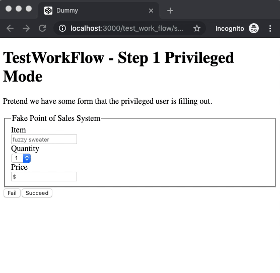

# PseudoKiosk


PseudoKiosk - a play on words on the unix sudo command allowing a privileged session to be utilized by another party temporarily. Instead of granting elevated privileges, PseudoKiosk gives the ability to limit access to the application during workflows which involve physically passing a device with elevated permissions to an unknown or untrusted user. PseudoKiosk provides the ability to lock down a rails application to only a specified whitelist of endpoints during a session. The kiosk can be quickly and easily unlocked by passing a kiosk passcode.

The motivating user scenario for this is a mobile, tablet, or kiosk device where data input must be received from an untrusted user while the device is mainly used by a privileged user (such as a cashier in a POS system). With PseudoKiosk, the device can be safely passed to the end customer to input his/her own information without fear of accidently or malicously utilizing the main user's elevated privileges. 

After the form has been successfully submitted, a simple friendly unlock screen is provided for the privileged user to quickly unlock the kiosk and continue the workflow. 

## Demo



You can also clone this repository and run the test application.

```
git clone https://github.com/jonmchan/pseudo_kiosk.git
cd pseudo_kiosk
bundle install
bundle exec rails s
```

Open http://localhost:3000 and you should see the same demo above. Passcode is `abc`.


## Installation
Add this line to your application's Gemfile:

```ruby
gem 'pseudo_kiosk'
```

And then execute:
```bash
$ bundle
```

Or install it yourself as:
```bash
$ gem install pseudo_kiosk 
```

## Usage

Add the PseudoKiosk::Engine to your `config/routes.rb`:

```
mount PseudoKiosk::Engine => "/pseudo_kiosk"
```

Add the before_action script to check all requests if it is in protected or not by putting it in your `app/controller/application_controller.rb` file:

```
before_action :secure_pseudo_kiosk
```

Create an initializer to configure pseudo_kiosk in `config/initializers/pseudo_kiosk.rb`:

The unlock mechanism can be a simple unlock string such as:
```
PseudoKiosk::Config.configure do |config|
  config.unlock_mechanism = "abc"
end
```

Or it can be a lambda function:
```
PseudoKiosk::Config.configure do |config|
  config.unlock_mechanism = ->(controller_context, params) {
    return Digest::SHA256.base64digest(params[:passcode]) == controller_context.current_user.passcode_hash ? true : false
  } 
end
```

The lambda function receives an instance of the controller which you can used to call functions such as current_user or session and all the params passed from the authentication unlock action. By default, the only parameter passed is `passcode`.


If you wish to override the default unlock screen, copy the [built in view](https://github.com/jonmchan/pseudo_kiosk/blob/master/app/views/pseudo_kiosk/authentication/unlock.html.erb) and put it in `app/views/pseudo_kiosk/authentication/unlock.html.erb`. Edit it to your heart's content.

### Core Functions

You can call any of these functions to go in and out of kiosk mode (refer to [code documentation](https://github.com/jonmchan/pseudo_kiosk/blob/master/lib/pseudo_kiosk/controller.rb)) 

* pseudo_kiosk_start(url_whitelist, unauthorized_endpoint_redirect_url)
* pseudo_kiosk_exit(unlock_redirect_url)
* clear_pseudo_kiosk_session


## Contributing
Feel free to submit PRs or Issues to the project's github page - https://github.com/jonmchan/pseudo_kiosk.

## License
The gem is available as open source under the terms of the [MIT License](https://opensource.org/licenses/MIT).
